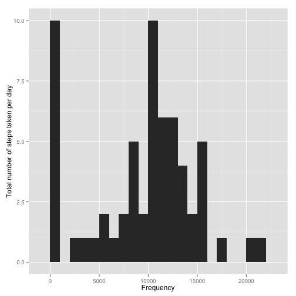
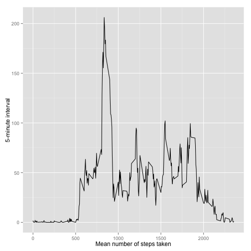
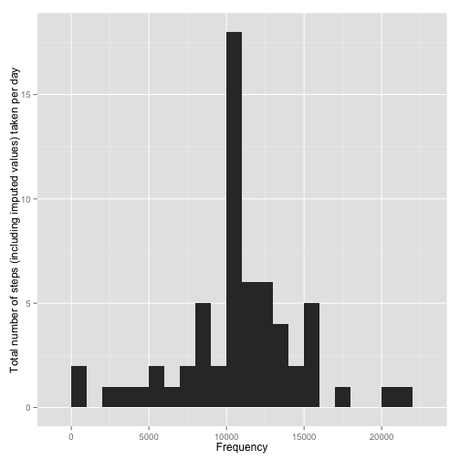
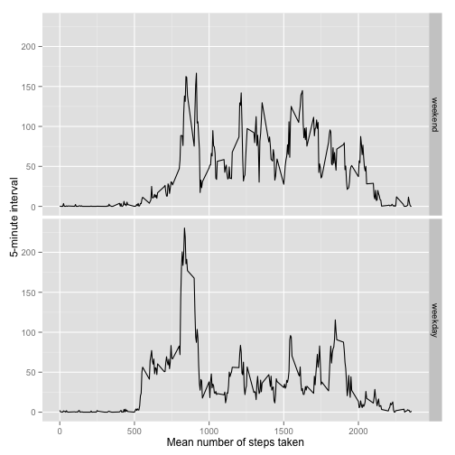

The following R code initially loads the required packages and sets some global options.


```r
library(knitr)
library(ggplot2)
library(plyr)
opts_chunk$set(echo=TRUE, warning=FALSE, message=FALSE)
```

## Loading and preprocessing the data

The following R code is used to unzip (if necessary) the zipped data
file, load the data, and add another column containing the date in the
class `Date`.


```r
stopifnot(file.exists("activity.zip"))

if (!file.exists("activity.csv")){
   unzip("activity.zip")
}

data <- read.csv(file="activity.csv")
data$date2 <- as.Date(data$date)
```

## What is mean total number of steps taken per day?

The following R code summarizes the data for each day, produces a
histogram of it, and calculates the mean and median of the total
number of steps taken per day.


```r
steps <- ddply(data, .(date), summarise, total=sum(steps, na.rm=TRUE))
steps.mean <- format(round(mean(steps$total, na.rm=TRUE), digits=2), scientific=FALSE)
steps.median <-format(median(steps$total, na.rm=TRUE), scientific=FALSE)

ggplot(steps, aes(x=total)) + geom_histogram(binwidth=1000) +
   xlab("Frequency") + ylab("Total number of steps taken per day")
```

 

The mean and median total number of steps taken per day are 9354.23 and 10395, respectively.


## What is the average daily activity pattern?

The following R code summarizes the data by each 5-minute interval,
produces a time series plot, and calculates the 5-minute interval that
contains the maximum number of steps.


```r
interval <- ddply(data, .(interval), summarise, mean.steps=mean(steps, na.rm=TRUE))
interval.max <- interval$interval[which.max(interval$mean.steps)]

ggplot(interval, aes(x=interval, y=mean.steps)) + geom_line() +
   xlab("Mean number of steps taken") + ylab("5-minute interval")
```

 

The maximum number of steps are contained in the 5-minute interval 835.

## Imputing missing values


```r
NA.total <- sum(is.na(data))
data.noNA <- data
data.noNA <- ddply(data.noNA, .(interval), transform, mean.steps=mean(steps, na.rm=TRUE))
NA.idx <- which(is.na(data.noNA$steps))
data.noNA$steps[NA.idx] <- data.noNA$mean.steps[NA.idx]
data.noNA$mean.steps <- NULL

steps.noNA <- ddply(data.noNA, .(date), summarise, total=sum(steps, na.rm=TRUE))
steps.noNA.mean <- format(round(mean(steps.noNA$total, na.rm=TRUE), digits=2), scientific=FALSE)
steps.noNA.median <- format(median(steps.noNA$total, na.rm=TRUE), scientific=FALSE)

ggplot(steps.noNA, aes(x=total)) + geom_histogram(binwidth=1000) +
   xlab("Frequency") + ylab("Total number of steps (including imputed values) taken per day")
```

 

The original dataset contains 2304 number of missing
values. In order to fill these values, the mean for the associated 5-minute
interval is taken as suggested in the task description. The dataset
`data.noNA` is created that replaces missing values by imputed
ones. The histogram of the total number of steps taken each day and
the calculation of the mean and median of this distribution is done as
before. The mean and median total number of steps taken per day are 10766.19 and 10766.19, respectively. Due to the
simplicity of the strategy of imputing values and the large number of
them, the impact of these values on the estimates is considerable, in
particular on the mean as one would expect.

## Are there differences in activity patterns between weekdays and weekends?


```r
data.noNA$weekday <- ifelse(weekdays(data.noNA$date2) %in% c("Saturday", "Sunday"), "weekend", "weekday")
data.noNA$weekday <- factor(data.noNA$weekday, levels=c("weekend", "weekday"))

interval <- ddply(data.noNA, .(interval,weekday), summarise, mean.steps=mean(steps, na.rm=TRUE))

ggplot(interval, aes(x=interval, y=mean.steps)) + geom_line() + facet_grid(weekday ~ .) +
   xlab("Mean number of steps taken") + ylab("5-minute interval")
```

 

The R code above creates the factor variable `weekday` with two levels
-- "weekday" and "weekend". The average number of steps taken is then
averaged across all weekday days or weekend days and illustrated as
time series plot. It is very obvious that both curves differ quite a
lot. In particular the middle part shows a lower number of steps
during weekdays compared to the weekend which is logical considering
that most people work in offices during weekdays.
